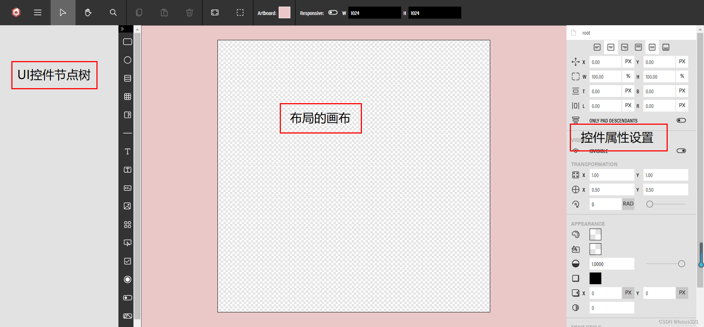

# GUI
## GUI介绍
GUI 系统允许开发者创建用户界面（UI），以与 3D 场景中的对象进行交互。   
GUI 主要由 AdvancedDynamicTexture 和 Control 类及其子类组成。  
Babylon官网提供了一个在线GUI编辑器，https://gui.babylonjs.com/   
 

###  AdvancedDynamicTexture
AdvancedDynamicTexture 是一个可以容纳多个控件的纹理。可以把它看作是一个容器，可以在其中添加按钮、文本框、图像等控件。
### Control
Control 是所有 GUI 控件的基类。它包含一些基本的属性和方法，如位置、大小、颜色等。    

### 常见的 Control 子类
&emsp;&emsp;Button: 一个可以点击的按钮。  
&emsp;&emsp;TextBlock: 用于显示文本的控件。  
&emsp;&emsp;Image: 显示图像的控件。   
&emsp;&emsp;Slider: 允许用户通过滑动来选择值的控件。  
&emsp;&emsp;CheckBox: 一个可以选中或取消选中的复选框。   
&emsp;&emsp;RadioButton: 一组中的一个选项，用户可以从中选择一个。   
&emsp;&emsp;ColorPicker: 允许用户选择颜色的控件。   

## GUI的创建方式
### GUI 通常涉及以下步骤：

1、创建 AdvancedDynamicTexture:    
&emsp;&emsp;创建一个 AdvancedDynamicTexture 实例，并指定其大小和其他属性。  
2、添加 Control:    
&emsp;&emsp;创建并配置各种 Control 实例，并将其添加到 AdvancedDynamicTexture 中。  
3、处理事件:   
&emsp;&emsp;对于像按钮这样的交互式控件，需要添加事件监听器来处理用户交互。   

### 方式一：全屏模式，只能创建一个
```javascript
// GUI
const advancedTexture = BABYLON.GUI.AdvancedDynamicTexture.
CreateFullscreenUI('UI',true);
//渲染分辨率和纹理大小之间的比率为 1。但可以使用
//advancedTexture.renderScale. 例如，如果想要更清晰的文本，这可能会很有用。
//设置分辨率
advancedTexture.idealWidth = 500
advancedTexture.idealHeight = 500
const button1=BABYLON.GUI.Button.CreateSimpleButton('btn','按钮')
button1.width = 5
button1.height = 1
button1.color = 'white'
button1.background = 'red'
button1.fontSize = 50
button1.onPointerUpObservable.add(function(){
  sphere.scaling.y = 5
})

// 追踪model的位置来定位，放大缩小移动屏幕，button1也会跟随model
button1.linkWithMesh(model)

advancedTexture.addControl(button1)
```


### 方式二：纹理模式
```javascript
const advancedTexture1 = BABYLON.GUI.AdvancedDynamicTexture.CreateForMesh(
    plane,
    1024,
    1024,
    false
)
const button1 = BABYLON.GUI.Button.CreateSimpleButton('btn','按钮')
button1.width = 5
button1.height = 1
button1.color = 'white'
button1.background = 'red'
button1.fontSize = 50
button1.onPointerUpObservable.add(function(){
    sphere.scaling.y = 5
})
advancedTexture1.addControl(button1)
```
在复杂的网格上处理指针移动事件可能代价高昂，因此可以使用第四个参数关闭支持指针移动事件。   

## observables属性
所有控件都有以下 observables：  
onPointerMoveObservable：当光标移到控件上时引发。仅在全屏模式下可用。   
onPointerEnterObservable：当光标进入控件时引发。仅在全屏模式下可用。  
onPointerOutObservable：当光标离开控件时引发。仅在全屏模式下可用。   
onPointerDownObservable：当指针在控件上向下时引发。  
onPointerUpObservable：当指针在控件上时引发。   
onPointerClickObservable：单击控件时引发。  
onClipboardObservable：在触发剪贴板事件时引发。  
#### 粘贴板示例：
```javascript
const advancedTexture = BABYLON.GUI.AdvancedDynamicTexture.CreateFullscreenUI('UI');
//设置分辨率
advancedTexture.idealWidth=500
advancedTexture.idealHeight=500
//即使设置了理想尺寸，全屏 UI 也会以与画布相同的分辨率呈现
//但可以决定（主要是出于性能原因）强制纹理也使用理想尺寸的分辨率
advancedTexture.renderAtIdealSize = true
const textblock = new BABYLON.GUI.TextBlock();
textblock.text = '复制（ctr+c）\n 点击网格';
textblock.fontSize = 24;
textblock.top = -100;
textblock.color = 'white';
advancedTexture.addControl(textblock);

//注册粘贴板事件
advancedTexture.registerClipboardEvents();

//将事件监听器添加到粘贴板的observabel
advancedTexture.onClipboardObservable.add((ev) => {
    //复制事件
    if (ev.type === BABYLON.ClipboardEventTypes.COPY){
        let pick = scene.pick(scene.pointerX, scene.pointerY);
        if (pick.hit){
            //SceneSerializer：场景序列化，SerializeMesh：序列化网格
            let selializedData =   BABYLON.SceneSerializer.SerializeMesh(pick.pickedMesh);
            let blob = new Blob([JSON.stringify(selializedData)], {type: 'application/json;charset=utf-8'});
            let url = URL.createObjectURL(blob);
            //将二进制数据流添加到粘贴板
            ev.event.clipboardData.setData('text/uri-list', url);
            textblock.text = 'ctr+v粘贴\n' + pick.pickedMesh.name;
        }
        
    }
    //粘贴事件
    if (ev.type === BABYLON.ClipboardEventTypes.PASTE){
        //粘贴板数据中存在text/uri-list
        if (ev.event.clipboardData.types.indexOf('text/uri-list') > -1){
            let blobURL = ev.event.clipboardData.getData('text/uri-list');
            //SceneLoader：场景阅读器
            BABYLON.SceneLoader.ImportMesh('', '', blobURL, scene,
                function(meshes){
                let position = new BABYLON.Vector3(Math.random() * 10 +
                Math.random() * (-10), Math.random() * 10 +
                Math.random() * (-10), Math.random() * 10);
                meshes[0].position = position;
            });
            textblock.text = '';
        }
    }
});

/* 
* 30秒后取消注册，这不是必需的，但在以下情况下很有用：
* 具有相同键绑定的任何其他事件。
*/
setTimeout(() => {
    textblock.text = '粘贴结束'
    //删除粘贴板事件
    advancedTexture.unRegisterClipboardEvents();
}, 60000);
```
#### 鼠标的observables示例：
```javascript
const advancedTexture = BABYLON.GUI.AdvancedDynamicTexture.CreateFullscreenUI('UI');
//设置分辨率
advancedTexture.idealWidth=500
advancedTexture.idealHeight=500
const panel = new BABYLON.GUI.StackPanel();    
advancedTexture.addControl(panel);   

const button = BABYLON.GUI.Button.CreateSimpleButton('but', 'Click Me');
button.width = 0.2;
button.height = '40px';
button.color = 'white';
button.background = 'green';
//右对齐
/*
*取值值可以取自BABYLON.GUI.Control.HORIZONTAL_ALIGNMENT_*
*BABYLON.GUI.Control.VERTICAL_ALIGNMENT_*
*/
button.horizontalAlignment = BABYLON.GUI.Control.HORIZONTAL_ALIGNMENT_RIGHT;
button.verticalAlignment = BABYLON.GUI.Control.VERTICAL_ALIGNMENT_BOTTOM;

let text = 0
button.onPointerDownObservable.add(function() {
    textblock.text = 'Down!';
});
button.onPointerUpObservable.add(function() {
    textblock.text = 'Up!';
    text += 1
    button.children[0].text='单机次数'+text
});
button.onPointerEnterObservable.add(function() {
    textblock.text = 'Enter!';
});
button.onPointerOutObservable.add(function() {
    textblock.text = 'Out!';
});    
button.onPointerMoveObservable.add(function(coordinates) {
    const relative = button.getLocalCoordinates(coordinates);
    textblock.text = relative.x + ', ' + relative.y;
});    
panel.addControl(button); 
```