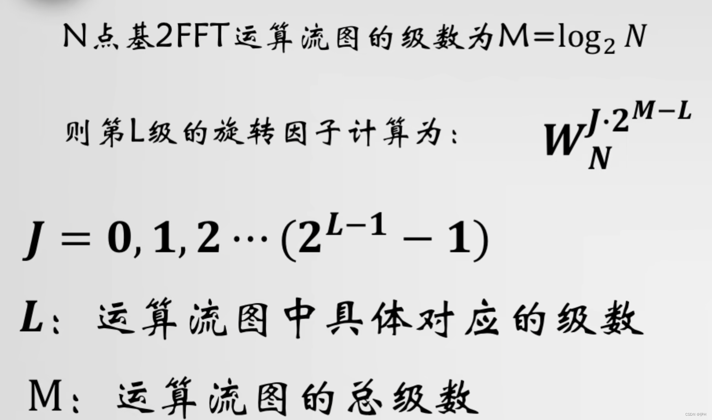
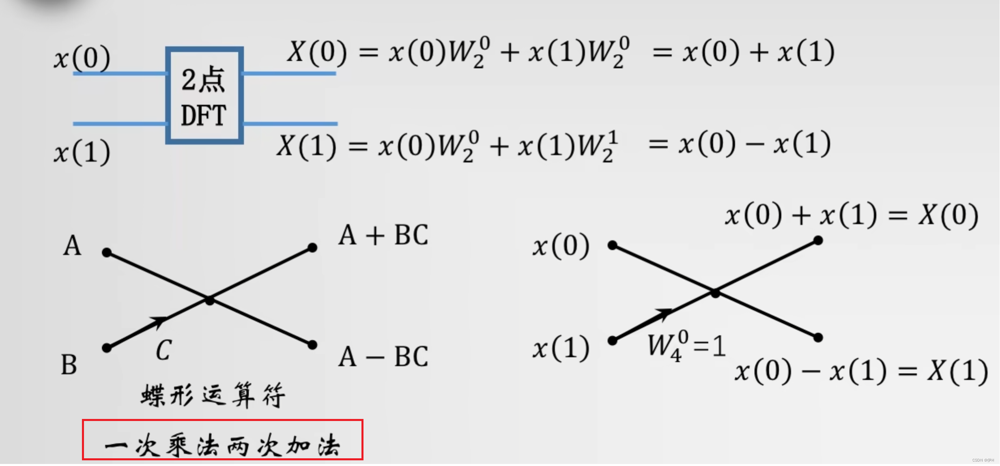
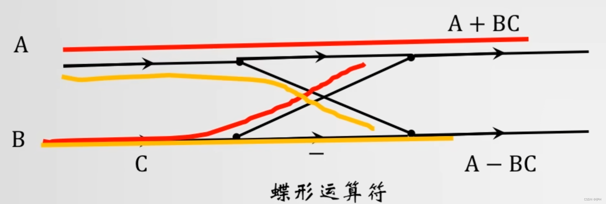
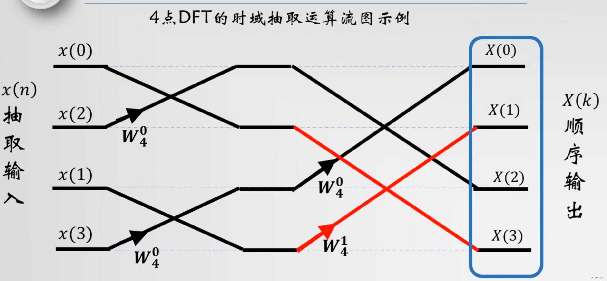
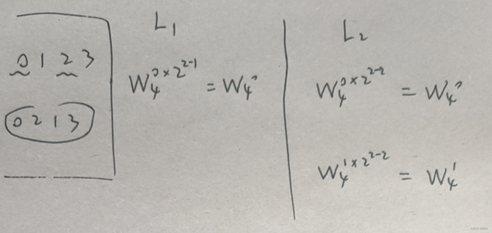
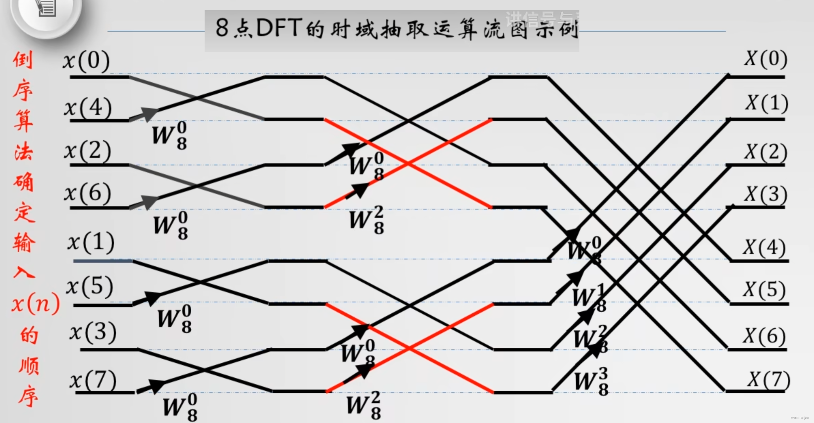
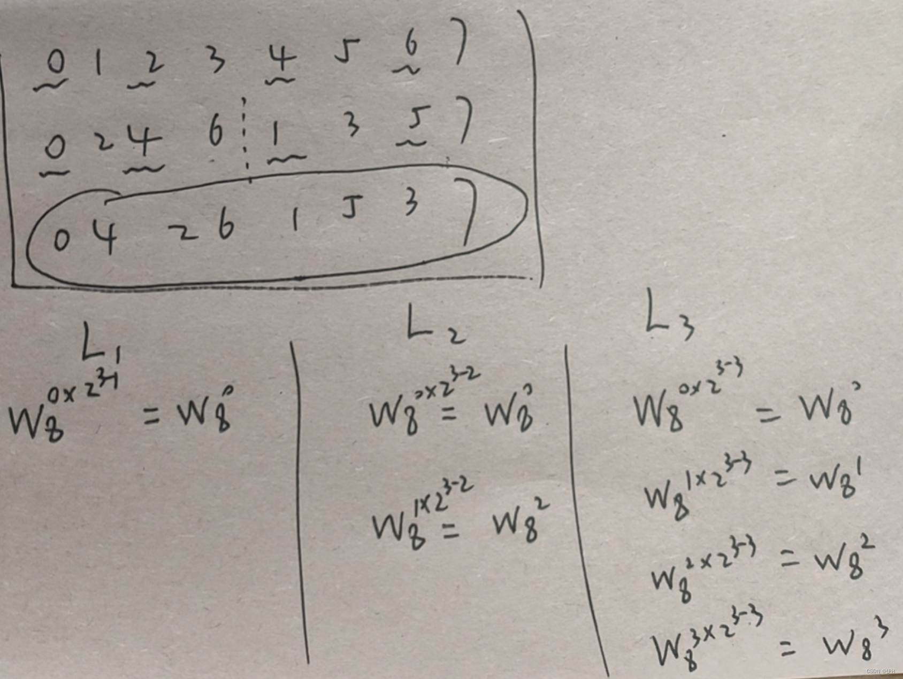
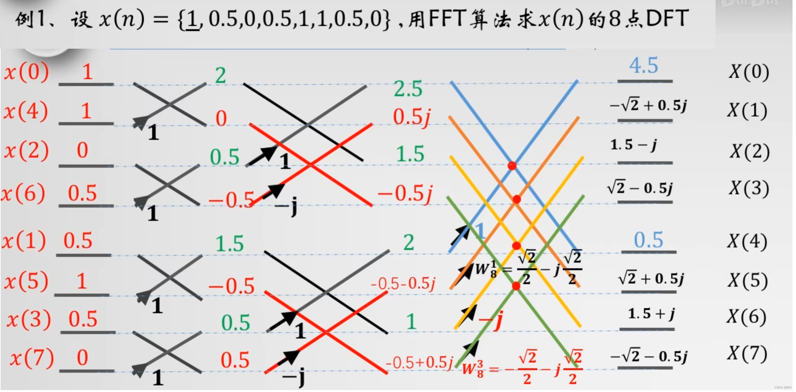
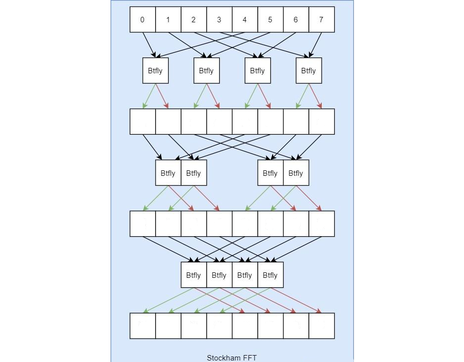

复数乘法
```javascript
(a+bi)×(c+di) = ac + adi + bci + bdi^2
进一步化简，考虑到i^2 = -1，得到：
ac + adi + bci - bd = (ac - bd) + (ad + bc)i
```
## 取W的原理










## Stockham FFT
以8*8为例子



在 **Stockham FFT** 中，**三轮计算**（即 `log2(N)` 轮，对于 `N=8` 是 3 轮）会逐步将输入数组 `a` 转换为频域结果。每轮的计算涉及 **蝶形运算（Butterfly Operation）** 和 **旋转因子（Twiddle Factors）** 的应用。  

### **Stockham FFT 三轮计算（N=8）**
给定输入数组 `A = [0, 1, 2, 3, 4, 5, 6, 7]`，进行 **3 轮 FFT 计算**，其中 `w = 1`（即不应用旋转因子，相当于 DFT 的简化情况）。  

---

### **第一轮（stride=1）**
- **跨度（stride）**：`1`，即间隔是 `N/(2*s) = 8/(2*1) = 4` 的元素配对
- **配对方式**：`(0,4), (1,5), (2,6), (3,7)`
- **旋转因子**：`w = 1`（无旋转）
- **计算**：
  - `B[0] = A[0] + A[4] = 0 + 4 = 4`
  - `B[4] = A[0] - A[4] = 0 - 4 = -4`
  - `B[1] = A[1] + A[5] = 1 + 5 = 6`
  - `B[5] = A[1] - A[5] = 1 - 5 = -4`
  - `B[2] = A[2] + A[6] = 2 + 6 = 8`
  - `B[6] = A[2] - A[6] = 2 - 6 = -4`
  - `B[3] = A[3] + A[7] = 3 + 7 = 10`
  - `B[7] = A[3] - A[7] = 3 - 7 = -4`
- **结果**：
  ```javascript
  B = [4, 6, 8, 10, -4, -4, -4, -4]
  把B的结果输入到A中，作为下一轮输入
  A = B
  ```

---

### **第二轮（stride=2）**
- **跨度（stride）**：`2`，即间隔是 `N/(2*s) = 8/(2*2) = 2` 的元素配对
- **配对方式**：`(0,2), (1,3), (4,6), (5,7)`
- **旋转因子**：`w = 1`（无旋转）
- **计算**：
  - `A = [4, 6, 8, 10, -4, -4, -4, -4]`（第一轮结果）
  - `B[0] = A[0] + A[2] = 4 + 8 = 12`
  - `B[2] = A[0] - A[2] = 4 - 8 = -4`
  - `B[1] = A[1] + A[3] = 6 + 10 = 16`
  - `B[3] = A[1] - A[3] = 6 - 10 = -4`
  - `B[4] = A[4] + A[6] = -4 + (-4) = -8`
  - `B[6] = A[4] - A[6] = -4 - (-4) = 0`
  - `B[5] = A[5] + A[7] = -4 + (-4) = -8`
  - `B[7] = A[5] - A[7] = -4 - (-4) = 0`
- **结果**：
  ```javascript
  B = [12, 16, -4, -4, -8, -8, 0, 0]
  把B的结果输入到A中，作为下一轮输入
  A = B
  ```

---

### **第三轮（stride=4）**
- **跨度（stride）**：`4`，即间隔是 `N/(2*s) = 8/(2*4) = 1` 的元素配对
- **配对方式**：`(0,1), (2,3), (4,5), (6,7)`
- **旋转因子**：`w = 1`（无旋转）
- **计算**：
  - `A = [12, 16, -4, -4, -8, -8, 0, 0]`（第二轮结果）
  - `B[0] = A[0] + A[1] = 12 + 16 = 28`
  - `B[1] = A[0] - A[1] = 12 - 16 = -4`
  - `B[2] = A[2] + A[3] = -4 + (-4) = -8`
  - `B[3] = A[2] - A[3] = -4 - (-4) = 0`
  - `B[4] = A[4] + A[5] = -8 + (-8) = -16`
  - `B[5] = A[4] - A[5] = -8 - (-8) = 0`
  - `B[6] = A[6] + A[7] = 0 + 0 = 0`
  - `B[7] = A[6] - A[7] = 0 - 0 = 0`
- **结果**：
  ```javascript
  B = [28, -4, -8, 0, -16, 0, 0, 0]
  把B的结果输入到A中，作为最终输出
  ```


## 跨步（stride）

在 Stockham FFT 算法中，**s** 表示当前阶段的 **跨步（stride）** 或 **蝶形运算的间隔**，其作用是控制蝶形运算中参与配对的元素之间的距离。  

---

`循环 s=2^i，i从0开始`   

---

具体来说：
### **s 的作用**
1. **s=1（第1级）**  
   - 蝶形运算的间隔为 1，即相邻元素配对：
     - \( X_1[0] = X_0[0] + X_0[4] \)（间隔 4，但这是由于 \( N/2 = 4 \)）
     - 更准确地说，**s 控制的是蝶形运算的“步长”**，而实际配对间隔是 \( N/(2s) \)。  
     - 在 Stockham 算法中，**s=1 时，蝶形运算的输入间隔是 \( N/2 \)**（即 4 个位置），但计算方式是按顺序遍历数组，每次步进 1。

2. **s=2（第2级）**  
   - 蝶形运算的间隔扩大为 2，即每隔 1 个元素取一对：
     - \( X_2[0] = X_1[0] + X_1[2] \)（间隔 2）
     - 此时，蝶形运算的输入间隔是 \( N/(2s) = 2 \)。

3. **s=4（第3级）**  
   - 蝶形运算的间隔扩大为 4，即每隔 3 个元素取一对：
     - \( X_3[0] = X_2[0] + X_2[1] \)（但实际是 \( X_2[0] + X_2[1] \) 因为 \( s=4 \) 时，Stockham 的分组方式变化）
     - 更准确地说，**s=4 时，蝶形运算的输入间隔是 \( N/(2s) = 1 \)**，但计算方式是按更复杂的分组进行。

### **更准确的解释（Stockham 算法特点）**
Stockham FFT 是一种 **原地（in-place）** 计算的 FFT，其核心特点是：
- **每一级（stage）的计算顺序不同**，不需要像 Cooley-Tukey 那样倒位序重排。
- **s 表示当前阶段的“块大小”**，即：
  - **s=1**：处理 \( N/2 \) 个蝶形，每个蝶形跨度 \( N/2 \)。
  - **s=2**：处理 \( N/4 \) 个蝶形，每个蝶形跨度 \( N/4 \times 2 = N/2 \)（但分组方式变化）。
  - **s=4**：处理 \( N/8 \) 个蝶形，每个蝶形跨度 \( N/8 \times 4 = N/2 \)（但分组更细）。

### **具体到例子（N=8）**
| 阶段 (s) | 蝶形运算的配对方式 | 实际计算示例 |
|----------|---------------------|-------------|
| **s=1** | 间隔 \( N/2 = 4 \) | \( X_1[0] = X_0[0] + X_0[4] \) <br> \( X_1[1] = X_0[1] + X_0[5] \) |
| **s=2** | 间隔 \( N/4 = 2 \) | \( X_2[0] = X_1[0] + X_1[2] \) <br> \( X_2[1] = X_1[1] + X_1[3] \) |
| **s=4** | 间隔 \( N/8 = 1 \) | \( X_3[0] = X_2[0] + X_2[1] \) <br> \( X_3[2] = X_2[2] + X_2[3] \) |

### **总结**
- **s 的作用**：控制蝶形运算的分组方式和输入间隔，使得每一级逐步合并更高频的分量。
- **Stockham 的特点**：通过调整 s 的值，实现 **原地计算**，无需位反转重排。
- **例子**： 
  - s=1：处理 4 个蝶形，每个跨度 4。
  - s=2：处理 2 个蝶形，每个跨度 2（但分组更细）。
  - s=4：处理 1 个蝶形（实际是并行处理多个），跨度 1（最终合并）。

这样，经过 3 级（Math.log2(8) = 3 ）计算后，得到最终的 FFT 结果。

--- 

## javascript实现

```javascript
function stockhamFFT(a) {
  const N = a.length
  let A = [...a] // 输入数组
  let B = new Array(N) // 输出数组

  for (let m = 0; m < 3; m++) {
    const stride = Math.pow(2, m)
    const halfStride = stride * 2
    for (let k = 0; k < stride; k++) {
      const w = 1 // 旋转因子（这里 w=1，简化计算）
      for (let i = k; i < N; i += halfStride) {
        const j = i + stride
        const x = A[i]
        const y = A[j] * w
        B[i] = x + y
        B[j] = x - y
      }
    }
    // 交换 A 和 B，准备下一轮
    [A, B] = [B, A]
  }
  return A // 最终结果在 A 中
}

const a = [0, 1, 2, 3, 4, 5, 6, 7]
console.log(stockhamFFT(a)) // [28, -4, -8, 0, -16, 0, 0, 0]
```