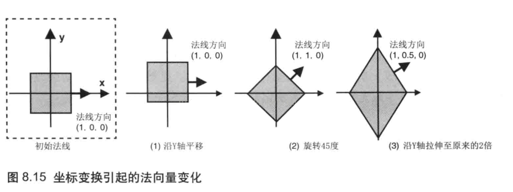

## 漫反射

在漫反射中，反射光的颜色取决于入射光的颜色、表面的基底色、入射光与表面形成的入射角。我们将入射角定义为入射光与表面的法线形成的夹角，并用θ表示，那么漫反射光的颜色可以根据下面的式子计算得到：   
<font color=red>漫反射光颜色 = 入射光颜色 x 表面基底色 x cosθ</font>   
可以通过计算两个矢量的<font color=red>点积</font>，来计算着两个矢量的夹角余弦值cosθ      
<font color=red>漫反射光颜色 = 入射光颜色 x 表面基底色 x (光线方向 · 法线方向)</font>     
这里有两点需要注意：    
（1）光线方向矢量和表面法线矢量的长度必须为1，否则反射光的颜色就会过暗或过亮。将一个矢量的长度调整为1，同时保持方向不变的过程称之为归一化。GLSL ES提供了内置的归一化函数，可以直接使用。    
（2）<font color=orange>这里所谓的“光线方向”，实际上是入射方向的反方向，即从入射点指向光源方向（因为这样，该方向与法线方向的夹角才是入射角）</font>    


## 环境反射
环境反射是针对环境光而言的。在环境反射中，反射光的方向可以认为就是入射光的反方向。有余环境光照射物体的方式就是各方面均匀、强度相等的，所以反射光也是各向均匀的，我们可以这样描述：   
<font color=red>环境发射光颜色 = 入射光颜色 x 表面基底色</font>     


## 最终颜色 
<font color=red>表面的反射光颜色 = 漫反射光颜色 + 漫反射光颜色</font>   

## 运动中的物体的光照效果
很多场景中，物体有可能会动，观察者的视角也很有可能会改变，必须考虑这种情况。首先，先看一下物体变动时，法向量的情况：   

平移变换不会改变法向量，因为平移不会改变物体的方向。   

旋转变换会改变法向量，因为旋转改变了物体的方向。    

缩放变换对法向量的影响较为复杂。如图所见，最右侧的图显示了立方体先旋转了45度，再在y轴上拉伸至原来的2倍的情况。此时法向量改变了，因为表面的朝向改变了。但是，如果缩放比例在所有的轴上都一致的话，那么法向量就不会变化。最后，即使物体在某些轴上的缩放比例并不一致，法向量也并不一定会变化，比如将最左侧图中的立方体在y轴方向上拉伸两倍，法向量就不会变化。       

所以，为了处理这种情况，矩阵中引入了一种魔法矩阵：逆转置矩阵。   

<font color=red>逆转置矩阵由矩阵先逆后转置，或者先转置后逆来得出。</font>  

### 逆矩阵

`逆矩阵本身并不直接表示缩放，但它在某些情况下可以用于实现与缩放相反的变换。`       

逆矩阵的定义：逆矩阵是指一个矩阵的逆元，即如果存在一个矩阵B，使得矩阵A乘以B等于单位矩阵I（在相应的数域上），则称B为A的逆矩阵，记为A"。逆矩阵的一个重要性质是，它可以将原矩阵所表示的变换“撤销”或“反转”。 

缩放矩阵的定义：缩放矩阵是一个对角矩阵，其对角线上的元素表示在各个维度上的缩放因子。   

`矩阵S =  `  
|sx, 0|        
|0, sy|       

逆矩阵与缩放矩阵的关系：对于缩放矩阵S，其逆矩阵S"可以通过将对角线上的缩放因子取倒数来得到    

`矩阵S" =  `  
|1/sx, 0|        
|0, 1/sy|       

这个逆矩阵实际上表示了一个与原缩放相反的变换。如果原缩放矩阵S将某个向量在x轴和y轴上分别放大了`sx`和`sy`倍，那么逆矩阵S"就会将这个向量在x轴和y轴上分别缩小到原来的`1/sx`和`1/sy`倍。  

因此，虽然逆矩阵本身不直接表示缩放，但它可以用于实现与缩放相反的变换，从而在某些情况下可以看作是一种“反向缩放”。  

### 转置矩阵

转置矩阵在数学和线性代数中扮演着重要的角色，`但直接将其与“旋转”联系起来并不总是准确的，因为转置矩阵主要代表的是矩阵行与列的互换，而不是几何意义上的旋转`。然而，`在特定的上下文中，特别是当涉及到正交矩阵时，转置矩阵与旋转操作之间确实存在一种紧密的联系，因为旋转矩阵是正交矩阵的一种特例`。       

转置矩阵的基本定义：给定一个矩阵 A，其转置矩阵 A(t) 是通过将 A 的行与列互换得到的。具体来说，如果 A 是一个 m×n 矩阵，那么 A(t) 是一个 n×m 矩阵。   

正交矩阵与旋转：正交矩阵是一种特殊的方阵，其行向量和列向量都是单位向量且两两正交（即点积为零）。正交矩阵的一个重要性质是其转置矩阵等于其逆矩阵，即 A(t) = A" 。       

在二维和三维空间中，正交矩阵可以表示旋转和/或反射操作。例如，在二维空间中，旋转角度 θ 的正交矩阵可以表示为： 

`Rθ=`          
|cos(θ), −sin(θ)|           
|sin(θ), cos(θ) |   

这个矩阵的转置矩阵是：    

`Rθ(t)=`       
|cos(θ), sin(θ)|           
|-sin(θ), cos(θ) |    

值得注意的是，这个转置矩阵实际上表示的是旋转角度 −θ 的操作，因为旋转矩阵的逆矩阵等于其转置矩阵且表示相反的旋转。     

虽然转置矩阵本身并不直接表示旋转，但在正交矩阵的上下文中，转置矩阵与旋转操作之间存在紧密的联系。具体来说，正交矩阵的转置矩阵等于其逆矩阵，且在某些情况下（如二维旋转矩阵），这个逆矩阵可以解释为相反的旋转操作。因此，在正交矩阵的语境下讨论转置矩阵与旋转的关系是合理的，但在更一般的矩阵理论中，这种关系并不成立。      


## threeJs光照计算

1、将光源位置（这是通过参数传入的）乘以模型视图矩阵（这是着色器提供给的），就能得到光源相对于摄像机的位置；  
2、将这一位置归一化（就是计算单位向量），得到光源相对于摄像机的角度；  
3、将其点乘单位法向量，得到亮度值（两个向量点乘的意思是，获得一个向量在另一个向量上的投影，所以，这里得到的是光源在法向量方向的投影长度，它决定了一个点有多亮）。

#### 注意：点乘（点积）、叉乘（叉积），二者不一样

---

#### 顶着色器：

```javascript
uniform vec3 color;
uniform vec3 light;

varying vec3 vColor;
varying vec3 vNormal;
varying vec3 vLight;

void main()
{
  // pass to fs
  vColor = color;
  // normalize: 归一化方法
  // 法向矩阵乘以法向量，并将其归一化后，传递给 vNormal。
  // 这是为了将物体坐标系下的法向量方向，转变成视图坐标系下的法向量方向。
  // 但是不能和光源位置 light 一样乘以 modelViewMatrix。
  // 虽然都是三维向量，但法向量表示的是一个方向，而光源位置表示的是一个坐标。
  // 如果用法向量乘以 modelViewMatrix 的话，得到的结果就可能不再垂直于面片了。
  vNormal = normalize(normalMatrix * normal);

  // viewMatrix: 视图矩阵
  // 使用光源位置乘以视图矩阵，得到光源在视图坐标系下的位置，传递给 vLight
  vec4 viewLight = viewMatrix * vec4(light, 1.0);
  vLight = viewLight.xyz;
  // projectionMatrix: 投影矩阵
  // modelViewMatrix: 模型视图矩阵，相当于视图矩阵 x 模型矩阵
  // position: 模型点坐标向量
  gl_Position = projectionMatrix * modelViewMatrix * vec4(position, 1.0);
}
```

#### 片着色器：

```javascript
varying vec3 vColor;
varying vec3 vNormal;
varying vec3 vLight;

// 这个 main 函数会被每个片元执行一次，并且是在 GPU 中并行执行的。
void main() {
  // 根据把归一化后的光源方向，和法向量进行点乘，计算每个片元的亮度值。
  float diffuse = dot(normalize(vLight), vNormal);

  // 根据亮度值，分别阶梯式地映射到新的亮度值，得到的 diffuse 是一个 0 到 1 之间的值。
  if (diffuse > 0.8) {
      diffuse = 1.0;
  }
  else if (diffuse > 0.5) {
      diffuse = 0.6;
  }
  else if (diffuse > 0.2) {
      diffuse = 0.4;
  }
  else {
      diffuse = 0.2;
  }

  // 基础颜色的 RGB 通道分别乘以阶梯式的亮度值，得到每个片元的颜色。
  // 并复制给 gl_FragColor 作为片元的颜色输出。
  gl_FragColor = vec4(vColor * diffuse, 1.0);
}
```

```javascript
var material = new THREE.ShaderMaterial({
  vertexShader: ...,  // 可以通过 AJAX 加载 *.vs 代码，内容传给这个变量
  fragmentShader: ...,
  uniforms: {
      color: {        // 苹果的基础色
          type: 'v3', // 指定变量类型为三维向量
          value: new THREE.Color('#60371b')
      },
      light: {
          type: 'v3',
          value: keyLight.position
      }
  }
});
mesh.material = material;
```
