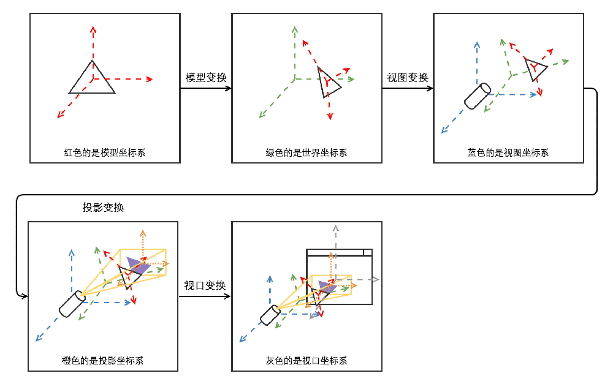
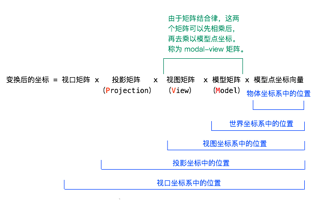

## 图解



又称为 MVP 矩阵  
从逻辑上来说，是先把模型点坐标向量乘以模型矩阵，然后乘以视图矩阵，然后乘以投影矩阵，然后乘以视口矩阵的。所以顺序的确是 MVP。

```javascript
            model        world      view        view      projection  projection   viewport
模型坐标---(模型变换)--->世界坐标---(视图变换)--->视图坐标--->(投影变换)--->投影坐标---(视口变换)--->视口坐标

--------------------------------------------------------------------------------------------------------------

模型变换（Model Transformation）
    模型矩阵 x 模型点坐标向量，得到世界坐标

视图变换（View Transformation）
    将世界坐标系中的物体转换到相机坐标系（也称为视图坐标系）。这个转换基于相机的位置和朝向，确保了从相机的视角观察场景。
    视图变换的步骤：
        1、相机位置和朝向（相机在世界坐标系中有一个位置，通常表示为CameraPosition；相机有一个朝向，这通常由一个前向向量Forward，一个上向量Up和一个右向量Right定义。）
        2、视图矩阵的构建（视图矩阵（View Matrix）是一个4x4矩阵，用于将世界坐标转换为相机坐标；这个矩阵通常通过相机的位置和朝向向量计算得出。它包含了相机的平移和旋转信息。）
        3、视图矩阵的计算（第一步，相机到世界，首先计算一个从相机指向世界的矩阵，这涉及到相机的逆旋转和平移。第二步，构建矩阵，使用相机的位置和朝向向量构建视图矩阵。）

投影变换（Projection Transformation）
    投影变换是将视图坐标转换为投影坐标的过程。这个过程涉及到构建一个投影矩阵，并将视图坐标中的每个顶点乘以这个矩阵。
    投影变换的目的是：
        1、透视投影：模拟人眼观察世界的方式，远处的物体看起来更小，近处的物体看起来更大。这通过透视除法实现，其中x、y、z坐标被除以w坐标（透视除法）。
        2、平行投影：保持物体的尺寸不变，无论它们离相机的距离如何。这通常用于技术绘图或一些特定的视觉效果。

视口变换（Viewport Transformation）
    它发生在投影变换之后，负责将投影坐标转换为屏幕上的实际像素坐标。
    这个过程包括两个主要步骤：缩放变换和平移变换
        1、缩放变换：缩放变换的目的是将标准立方体（通常是[-1, 1]³）的x和y轴长度分别缩放到屏幕的宽度和高度。由于-1到1的距离是2，所以缩放长度分别为屏幕宽度的一半和高度的一半。
        2、平移变换：平移变换将标准立方体的中点从原点平移到屏幕中心。在屏幕坐标系中，屏幕的中心通常是(width/2, height/2)，其中width和height是屏幕的宽度和高度。
    视口变换的结果就是将3D场景中的物体映射到2D屏幕上的特定区域。这个映射过程确保了渲染的图像能够正确地显示在屏幕上，并且与显示设备的像素对应起来。
    视口变换完成后，物体到屏幕的所有变换都完成了，接下来的步骤是光栅化，即将这些结果信息变成屏幕上的像素。光栅化是将几何图形转换为像素的过程，这是渲染管线中的下一步。
    总结来说，视口变换是将投影坐标（通常是归一化的设备坐标，范围在[-1, 1]之间）转换为屏幕上的实际像素坐标的过程，它定义了屏幕上的显示区域，并确定了顶点屏幕坐标的变换方式。

--------------------------------------------------------------------------------------------------------------

世界坐标（World Coordinates）
    指的是一个物体在3D世界空间中的位置和方向，这个空间是相对于整个场景或宇宙的全局坐标系
    World Position = Model Matrix × Local Position

视图坐标（View Coordinates）
    视图坐标是经过视图变换后的坐标系，它代表了从相机视角观察到的3D世界。
    在这个坐标系中：
        1、位置：物体的位置是相对于相机的位置来确定的。如果相机位于原点并朝向负z轴，那么正z轴方向的物体会远离相机，而负z轴方向的物体会靠近相机。
        2、方向：物体的方向也是相对于相机的朝向来确定的。相机的前向向量通常指向负z轴，上向量指向y轴的正方向。

投影坐标（Projective Coordinates）
    投影坐标是经过投影变换后的坐标系，它们位于裁剪空间（Clipping Space）中。
    在这个坐标系中：
        1、坐标范围：坐标通常位于[-1, 1]的范围内，x和y坐标表示水平和垂直位置，z坐标表示深度（从相机到物体的距离）。
        2、透视除法：对于透视投影，投影坐标需要进行透视除法，即将x、y、z坐标除以w坐标，以将坐标归一化到[-1, 1]的范围内。
        3、裁剪：裁剪操作会移除超出[-1, 1]范围的坐标，这些坐标不会被渲染到屏幕上。

视口坐标（Viewport Coordinates）
    1、视口坐标的特点：
        像素单位：视口坐标是以像素为单位的，它们直接对应于屏幕上的像素位置。
        坐标范围：视口坐标的范围取决于视口的大小。如果视口的宽度和高度分别是width和height，那么视口坐标的x范围是从0到width-1，y范围是从0到height-1。
        与设备相关：视口坐标是与具体显示设备相关的，它们考虑了屏幕的分辨率和像素密度。
    2、视口坐标的转换过程：
        归一化设备坐标（NDC）：在视口变换之前，坐标通常处于归一化设备坐标（NDC）中，其范围是[-1, 1]。
        视口变换：视口变换将NDC坐标转换为视口坐标。这个转换包括缩放和偏移操作。缩放：将NDC坐标从[-1, 1]映射到视口的宽度和高度。偏移：将坐标平移，使得视口的左下角成为原点。
        裁剪：在转换过程中，任何超出视口范围的坐标都会被裁剪掉，不会在屏幕上显示。
    3、视口坐标的应用：
        光栅化：视口坐标用于光栅化过程，即将几何图形转换为屏幕上的像素。光栅化器使用视口坐标来确定哪些像素需要被填充颜色。
        用户交互：在处理用户输入（如鼠标点击或触摸）时，视口坐标用于将屏幕坐标转换为世界坐标或视图坐标，以便确定用户交互的具体位置。

--------------------------------------------------------------------------------------------------------------

                       projection   view   modelMatrix   position
变换后的坐标 = 视口矩阵 x 投影矩阵 x 视图矩阵 x 模型矩阵 x 模型点坐标向量
mvp
模型视图矩阵-------->由于矩阵结合律，view和model可以先相乘后，再乘以模型点坐标向量，称为model-view矩阵

--------------------------------------------------------------------------------------------------------------

模型点坐标向量 (Model Point Coordinates):
这是3D模型中顶点的原始坐标。这些坐标是相对于模型自身的局部坐标系的。(一般都是使用position.xyz)

模型矩阵 (Model Matrix):
模型矩阵用于将模型的局部坐标转换到世界坐标系中。这个矩阵包含了模型的位置、旋转和缩放信息。通过乘以模型矩阵，可以将模型放置在世界空间中的任何位置。

视图矩阵 (View Matrix):
视图矩阵代表了相机的位置和朝向。它将世界坐标转换到相机坐标系中。这个矩阵通常包含了相机的位置（负值表示相机看向的方向）和相机的朝向（旋转）。

投影矩阵 (Projection Matrix):
投影矩阵定义了相机的投影方式，比如透视投影或正交投影。它将相机坐标系中的坐标转换到裁剪坐标系中。裁剪坐标系是一个标准化的坐标系，其中x、y、z坐标的范围通常是-1到1。

视口矩阵 (Viewport Matrix):
视口矩阵将裁剪坐标系中的坐标转换到屏幕坐标系中。这个矩阵定义了屏幕空间的尺寸和位置，它将裁剪坐标映射到窗口或视口的像素坐标上。
```

#### 一个物体的三维坐标向量(position)，乘以模型视图矩阵(modelView)后，能够得到它在视图坐标系中的位置，也就是它相对于摄像机的坐标位置。

#### ----------------------------------------------------------------------------------------------

#### 以下这个是获取到 xyz 的位置

```javascript
vec4(position, 1.0): 将vec3类型的position转换为vec4类型，添加一个额外的w分量，设置为1.0。这是为了与4x4模型矩阵兼容
modelMatrix * vec4(position, 1.0): 将模型矩阵与扩展的顶点位置向量相乘，将顶点从局部坐标转换到世界坐标
世界坐标：指的是一个物体在3D世界空间中的位置和方向，这个空间是相对于整个场景或宇宙的全局坐标系

v_position = vec3(modelMatrix * vec4(position, 1.0))
f_position = (modelMatrix * vec4(position, 1.0)).xyz

v_position.xyz === f_position
```

#### ModelMatrix（模型矩阵）、ModelViewMatrix（模型视图矩阵）、ProjectionMatrix（投影矩阵）、NormalMatrix（正规矩阵）

position 是顶点在物体坐标系（而不是世界坐标系）中的位置  
意味着，一个正方体位于世界坐标系的(2, 0, 0)与位于(0, 0, 0)将不会改变任何顶点的 position  
position 是相对于正方体的锚点而言的  
因此，顶点着色器的作用就是将 uv 信息传递到片元着色器中，并按默认的方式计算顶点位置

```javascript
gl_Position = projectionMatrix * modelViewMatrix * vec4(position, 1.0)
```