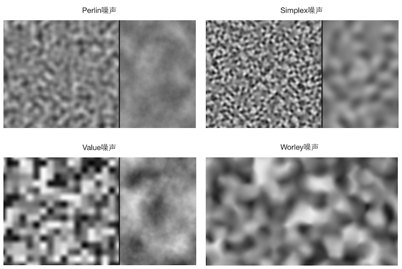

## perlin和fbm【二者是不一样的】
具体内容网址：【https://www.cnblogs.com/xiaowangba/p/6314642.html】      

***

根据wiki，由程序产生噪声的方法大致可以分为两类：

| 类别| 名称|
| ---| ---|
| 基于晶格的方法（Lattice based）| 又可细分为两种：<br>第一种是 [梯度噪声（Gradient noise](https://en.wikipedia.org/wiki/Gradient_noise)），包括 [Perlin噪声](https://en.wikipedia.org/wiki/Perlin_noise)， [Simplex噪声](https://en.wikipedia.org/wiki/Simplex_noise)， [Wavelet噪声](https://en.wikipedia.org/wiki/Wavelet_noise) 等；<br>第二种是 [Value噪声（Value noise）](https://en.wikipedia.org/wiki/Value_noise)。|
| 基于点的方法（Point based）| [Worley噪声](https://en.wikipedia.org/wiki/Worley_noise)|

需要注意的是，一些文章经常会把Perlin噪声、Value噪声与 [分形噪声（Fractal noise）](https://en.wikipedia.org/wiki/Pink_noise) 弄混，这实际在概念上是有些不一样的。分形噪声会把多个不同振幅、不同频率的octave【一个Octave代表了一层特定频率和振幅的噪声】相叠加，得到一个更加自然的噪声。而这些octave则对应了不同的来源，它可以是Gradient噪声（例如Perlin噪声）或Value噪声，也可以是一个简单的 [白噪声](https://en.wikipedia.org/wiki/White_noise)（White noise）。

一些非常出色的文章也错误把这种分形噪声声称为Perlin噪声，例如：

- [Hugo Elias的文章](http://freespace.virgin.net/hugo.elias/models/m_perlin.htm)，这篇文章讲得挺有趣的，关于什么是octave、怎么混合它们都讲得很细致，也非常有名，但作者错误地把值噪声+分形噪声标识为Perlin噪声，他的文章链接也出现了wiki的 [值噪声（Value noise）的页面中。](https://en.wikipedia.org/wiki/Value_noise)

- Devmag的 [如何在你的游戏中使用Perlin噪声](http://devmag.org.za/2009/04/25/perlin-noise/) 一文，同样非常有名，但同样错误地把白噪声+分形噪声认为是Perlin噪声。

***

如果常逛shadertoy的话，会发现很多shader使用了类似名为fbm的噪声函数。fbm实际就是分型布朗运动（Fractal Brownian Motion）的缩写，可以把它等同于上面所说的分形噪声（Fractal noise）。如果要通俗地说fbm和之前提及的Perlin噪声、Simplex噪声、Value噪声、白噪声之间的联系，可以认为是很多个不同频率、不同振幅的基础噪声（指之前提到的Perlin噪声、Simplex噪声、Value噪声、白噪声等之一）之间相互叠加，最后形成了最终的分形噪声。这里的频率指的是计算噪声时的采样距离，例如对于基于晶格的噪声们，频率越高，单位面积（特指二维）内的晶格数目越多，看起来噪声纹理“越密集”；而振幅指的就是噪声的值域。

***




***

## octave的意思
在噪声（Noise）和分形噪声（Fractal Noise）的语境中，Octave（八度）是一个核心概念，它直接借用了音乐术语：   
**一个Octave代表了一层特定频率和振幅的噪声。**

##### 直观理解

想象在生成山脉地形：
 - 第1个Octave：决定巨大的山脉轮廓（低频、高振幅）→ 大起伏
 - 第2个Octave：在山脉上添加一些丘陵（频率×2，振幅÷2）→ 中等细节
 - 第3个Octave：在丘陵上添加岩石和巨石（频率×4，振幅÷4）→ 小细节
 - 第4个Octave：添加石子和沙粒（频率×8，振幅÷8）→ 微小细节
叠加所有这些Octave，就能得到极具真实感的自然地形。  

在分形噪声（Fractal Brownian Motion, fbm）中，Octave的叠加遵循严格的数学规律：   

```javascript
fbm(p) = Σ [ octave_i ]
octave_i = amplitude_i × noise(frequency_i × p)
```

其中：
 - frequency_i = lacunarity^i  （通常 lacunarity = 2，即每级频率翻倍）
 - amplitude_i = persistence^i  （通常 persistence = 0.5，即每级振幅减半）

```javascript
float noise_sum(vec2 p) {
  float f = 0.0;
  p = p * 4.0;          // 基础频率
  f += 1.0000 * noise(p); p = 2.0 * p;  // Octave 1
  f += 0.5000 * noise(p); p = 2.0 * p;  // Octave 2 (频率×2, 振幅×0.5)
  f += 0.2500 * noise(p); p = 2.0 * p;  // Octave 3 (频率×4, 振幅×0.25)
  f += 0.1250 * noise(p); p = 2.0 * p;  // Octave 4 (频率×8, 振幅×0.125)
  f += 0.0625 * noise(p); p = 2.0 * p;  // Octave 5 (频率×16, 振幅×0.0625)
  return f;
}
```

每一行 noise(p) 调用就是一个独立的Octave层。    
关键参数：
 - Octave数量：越多细节越丰富，但计算量越大（通常是4-8个）
 - Lacunarity（频率倍增值）：默认2.0，控制细节密集程度
 - Persistence（振幅 persistence）：默认0.5，控制细节减弱速度
理解Octave是掌握程序生成内容（地形、云层、纹理等）的核心，用数学方式"雕刻"出不同尺度的自然细节。