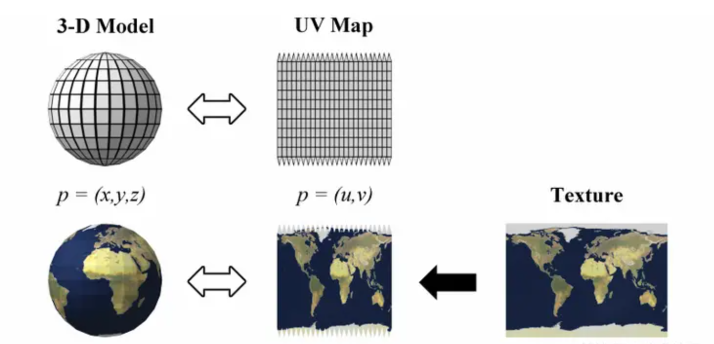
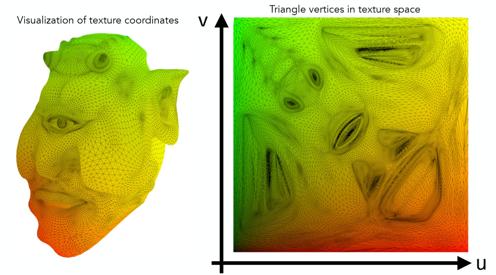
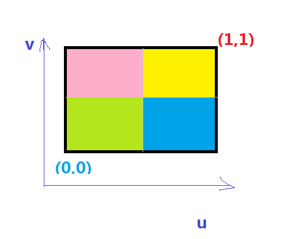

## UV坐标

UV 是二维纹理坐标，U 代表水平方向，V 代表垂直方向。UV Map 用来描述三维物体表面与图像纹理(Texture) 的映射关系，有了 UV Map，可以将二维的图像纹理粘贴到三维的物体表面。  
UV 坐标为纹理坐标，在纹理空间中，任意一个二维坐标都在【0，1】内。

纹理坐标的 U 和 V 的最大值均为 1，每张纹理图 Texture map 的（u，v）坐标均可存储在三维 Mesh 的各个顶点信息中，这个存储操作即为两者之间的映射关系。在 UV 坐标系（或者 UVW 坐标系）中，显示器水平方向是 U（大小 0-1），显示器竖直方向是 V（大小 0-1），（W 的方向垂直于显示器表面）。

纹理的映射是将纹理图贴到多边形表面的过程。  
映射就是通过（u，v）坐标去查找对应的颜色值，例如下图：

上面的图是一个很简单的示意图，其中（0,0）点和（1,1）点可能根据引擎或者其他的规定，位置会有变化，但是大体来说基本上都是这样的。如果 UV 是（0.1, 0.1）取得颜色值就是绿色，如果 UV 是（0.2, 0.8）取得颜色值就是粉色，如果 UV 是（0.7, 0.2）取得颜色值就是蓝色，如果 UV 是（0.9,0.9） 取得颜色值就是黄色。

## 裁剪空间坐标

##### webgl是默认 裁剪空间坐标 [−1,1]
##### shaderToy、babylon、three等，使用的shader是默认 UV坐标 [0,1]