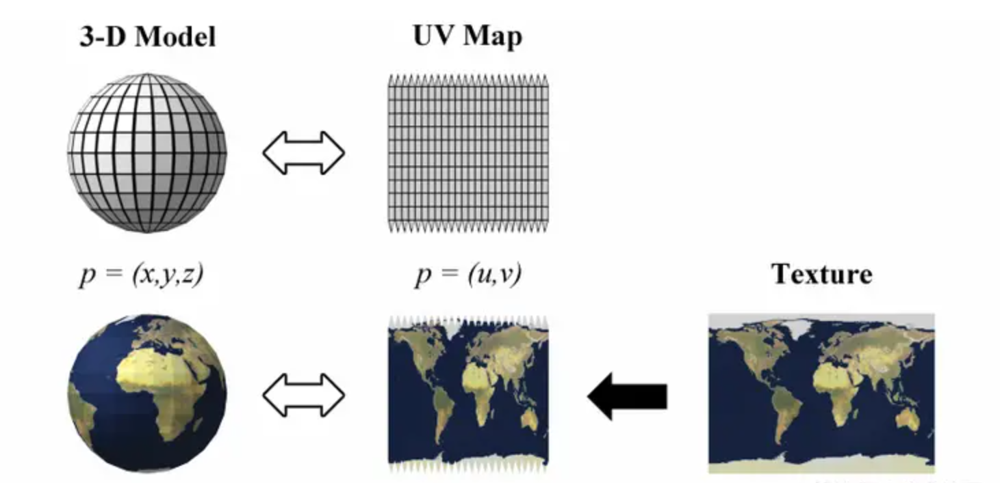
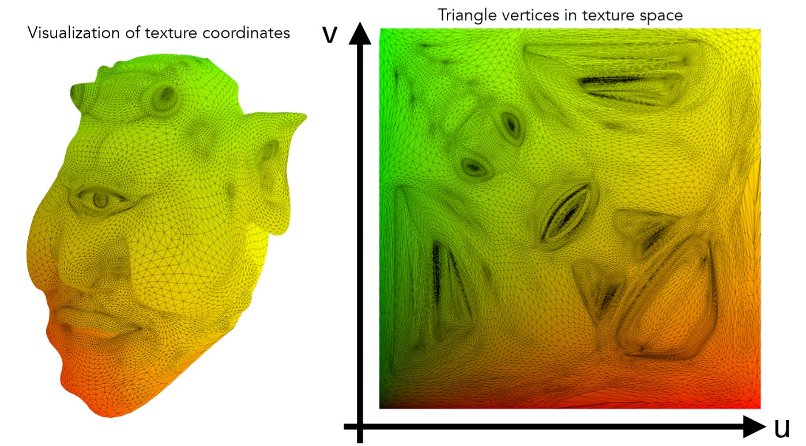
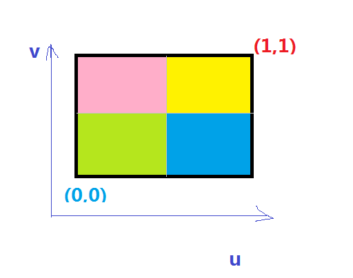

## UV 坐标

UV 是二维纹理坐标，U 代表水平方向，V 代表垂直方向。UV Map 描述三维物体表面与图像纹理（Texture）的映射关系——有了 UV Map，就可以将二维图像纹理"粘贴"到三维物体表面。

在 UV 坐标系（或 UVW 坐标系）中，U 对应水平方向，V 对应垂直方向，W 垂直于显示器表面。**U 和 V 的范围均为 \[0, 1\]**，每张纹理图的 (u, v) 坐标可存储在三维 Mesh 的各顶点信息中，这一存储操作即为两者间的映射关系。





纹理映射就是通过 (u, v) 坐标查找对应颜色值的过程：



注意：(0,0) 和 (1,1) 的具体位置可能因引擎或规范而异。以上图为例，UV (0.1, 0.1) 对应绿色，(0.2, 0.8) 对应粉色，(0.7, 0.2) 对应蓝色，(0.9, 0.9) 对应黄色。

## 后处理渲染中 UV 的 v 轴为什么是反的

在后处理渲染（如全屏四边形采样场景纹理）中，UV 的 v 分量需要翻转，原因是 **NDC 坐标系与纹理 UV 坐标系的 y 轴方向相反**。

### 两个坐标系的 y 轴方向

**NDC（裁剪/屏幕空间）**：y 向上为正

```
y=+1  ──── 屏幕顶部
  │
y= 0  ──── 屏幕中心
  │
y=-1  ──── 屏幕底部
```

**纹理 UV 坐标**：v 向下为正

```
v=0   ──── 纹理顶部（图像第一行）
  │
v=0.5 ──── 纹理中心
  │
v=1   ──── 纹理底部（图像最后一行）
```

### 顶点对应关系

| 屏幕位置 | NDC y | 不翻转（错误） | 翻转后（正确） |
|---------|-------|-------------|-------------|
| 屏幕顶部 | +1 | v=1 → 纹理底部 | v=0 → 纹理顶部 |
| 屏幕底部 | -1 | v=0 → 纹理顶部 | v=1 → 纹理底部 |

以全屏四边形的顶点为例：

```wgsl
// NDC 位置             // UV（不翻转，错误）   // UV（翻转后，正确）
vec2f(-1.0, -1.0)  // 左下角  vec2f(0.0, 0.0)  →  vec2f(0.0, 1.0)
vec2f( 1.0, -1.0)  // 右下角  vec2f(1.0, 0.0)  →  vec2f(1.0, 1.0)
vec2f(-1.0,  1.0)  // 左上角  vec2f(0.0, 1.0)  →  vec2f(0.0, 0.0)
```

### 根本原因

场景纹理是从**屏幕顶部到底部**写入的：顶部像素存在 v=0，底部像素存在 v=1。读取时，屏幕底部（NDC y=-1）必须对应纹理底部（v=1），两个方向才能对齐，否则画面会上下颠倒。

翻转公式等价于：

```
uv.v = 1.0 - (ndc.y * 0.5 + 0.5)
```

实践中通常直接用硬编码的 UV 数组实现，无需在 shader 中显式计算。
